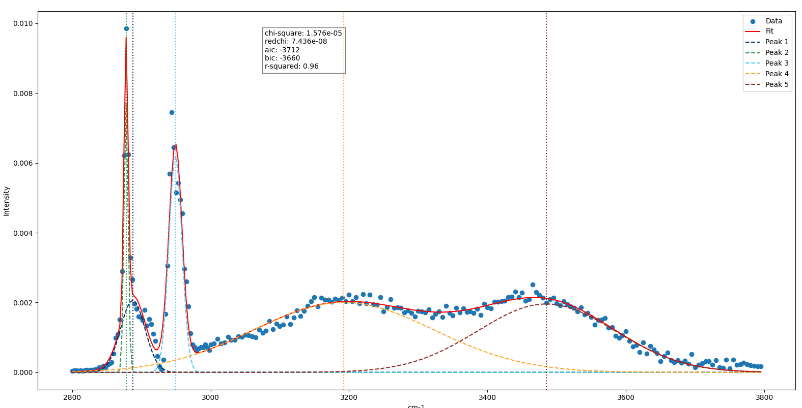

# SFG Plotter
## Description
 - takes sum frequency generator data from csv and plots it
 - can automatically generate parameters or take them from another csv
 - outputs plot of data, fit, and statistics

## To-do
 - automate parameter optimization

image:
